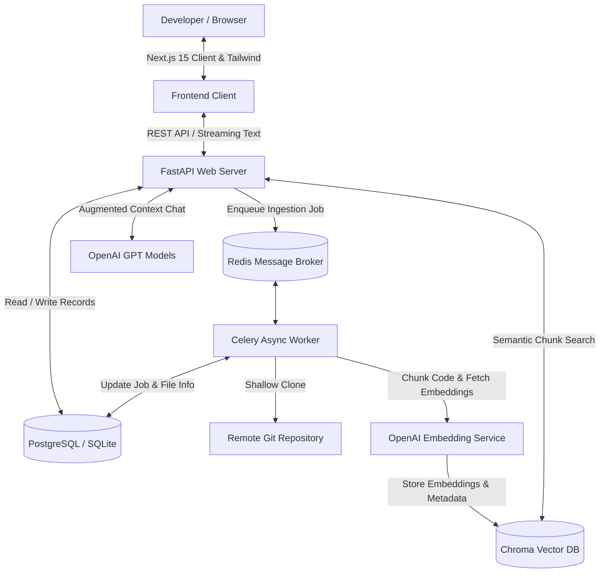

# 🔍 GitHub Repo Analyzer (GRA)

[](https://fastapi.tiangolo.com)
[](https://nextjs.org)
[](https://tailwindcss.com)
[](https://docs.celeryq.dev)
[](https://www.trychroma.com)
[](https://www.docker.com)

GitHub Repo Analyzer is a professional-grade, full-stack **Retrieval-Augmented Generation (RAG)** platform designed to clone, parse, index, and analyze software codebases. By extracting code syntax trees (ASTs), generating file summaries, and storing vector embeddings, the system powers semantic codebase search, citation-backed AI chat, static bug audits, security vulnerability reports, automated documentation generation, repository health scoring, and interactive onboarding courses.

---

## 🏛️ System Architecture

The following diagram illustrates how the frontend client, backend API gateway, async workers, SQL database, and vector storage engines collaborate:



---

## ✨ Features

- **🚀 Automated Repository Ingestion**: Fetches remote Git repositories securely, respects custom `.gitignore` rules, prevents bloating by filtering binary formats, and scales using a Celery task queue.
- **🌳 AST-Based Chunking & Parsing**: Uses `tree-sitter` and `tree-sitter-languages` to parse Python and other languages, preserving class/function boundaries during RAG chunking to prevent out-of-context retrieval.
- **💬 Citation-Backed Codebase Chat**: Ask context-specific questions and receive real-time streamed responses with explicit line numbers and file path sources as citations.
- **🔍 Semantic & Filtered Search**: Conduct semantic code-level searches scoped to specific folders, languages, or symbols using vector similarity scoring.
- **🛡️ Static Bug & Security Audits**: 
  - **Security**: Identifies hardcoded keys/secrets, SQL injections via string interpolation, unguarded routes lacking auth checks, and default weak JWT signing configurations.
  - **Bugs**: Identifies duplicate code bodies, bare except blocks that swallow failures, unreachable logic paths, and unused local variables.
- **📊 Repository Health Scoring**: Computes a detailed, 100-point multi-dimensional health card spanning *Documentation*, *Testing*, *Architecture*, *Security*, *Maintainability*, and *Performance*.
- **🎓 Interactive Developer Onboarding**: Generates structured onboarding modules with checkpoint hints covering the project’s architecture, database models, route security, folders, and deployment strategies.
- **📄 Documentation Bundler**: Instantly compiles customized developer resources including a `README.md`, `API.md` (via OpenAPI schemas), `Architecture.md` (with dynamic Mermaid diagrams), and Installation, Contribution, and Developer guides, download-ready in a ZIP bundle.

---

## 📁 Repository Directory Structure

```text
├── alembic/                       # Database schema migrations tracker
│   ├── env.py                     # Alembic configuration runtime script
│   └── versions/                  # Initial and incremental database schema versions
│
├── app/                           # Backend Application Source Code
│   ├── api/                       # API Route definitions & Dependency injection
│   │   ├── deps.py                # Database connection and User Authentication guards
│   │   └── routes/                # FastAPI endpoint handlers (Auth, Repos, Intelligence, Onboarding)
│   ├── core/                      # Application Settings, Custom Errors, and Logger
│   ├── db/                        # Database engine initialization and session builders
│   ├── models/                    # SQLAlchemy database tables mapping
│   ├── rag/                       # LLM providers, prompts, context filters, and chunk budgets
│   ├── repositories/              # Query abstraction layer (SQL Data Access)
│   ├── schemas/                   # Pydantic schemas (Request validation & Response serialization)
│   ├── services/                  # Business Logic orchestration (Git cloning, Ingestion, Analysis)
│   └── tasks/                     # Celery application setup and asynchronous jobs
│
├── frontend/                      # Next.js 15 Web Application
│   ├── app/                       # App Router paths (Register, Login, Dashboard, Search, Chat, Audit)
│   ├── components/                # Reusable UI component elements (cards, inputs, layout containers)
│   └── lib/                       # Frontend API clients and Axios client wrappers
│
├── scripts/                       # Support tasks & automated mock database seeding
├── tests/                         # Pytest test suite for validation coverage
│
├── docker-compose.yml             # Full-Stack services configuration file
├── Dockerfile                     # Backend server production runtime packaging
├── Makefile                       # Convenient shell command aliases
└── pyproject.toml                 # Standard python packaging setup & dependencies list
```

---

## 🛠️ Configuration & Environments

Both the local setup and Docker compose depend on environment variables. Copy the `.env.example` to `.env` and fill in the values:

```bash
cp .env.example .env
```

### Environment Variables Matrix

| Variable | Description | Default Value | Required |
| :--- | :--- | :--- | :--- |
| `APP_NAME` | The title displayed in API documentation | `GitHub Repo Analyzer` | No |
| `ENVIRONMENT` | Deployment environment mode | `development` | No |
| `DEBUG` | Toggle verbose trace logs and debug responses | `true` | No |
| `SECRET_KEY` | Key used to sign JWT auth tokens | *User must set* | **Yes** |
| `DATABASE_URL` | SQLAlchemy connection string | `sqlite+pysqlite:///./dev.db` | No (dev/docker auto) |
| `REDIS_URL` | Broker backend cache URI | `redis://localhost:6379/0` | No |
| `CELERY_BROKER_URL` | Broker queue URL for worker task coordination | `redis://localhost:6379/0` | No |
| `CHROMA_PERSIST_DIR` | Filesystem storage path for vector store databases | `./chroma` | No |
| `OPENAI_API_KEY` | Key required for OpenAI embeddings and text inference | *User must set* | **Yes** |
| `OPENAI_EMBEDDING_MODEL` | Chosen embedding matrix generator model | `text-embedding-3-small` | No |
| `LLM_PROVIDER` | Driver provider for generative model queries | `openai` | No |
| `LLM_MODEL` | Chosen model for code understanding & reasoning | `gpt-4.1-mini` | No |

---

## ⚡ Quick Start

The fastest way to spin up the entire application stack (API, Redis, PostgreSQL, ChromaDB, Celery worker, and Frontend UI) is using **Docker Compose** via the provided `Makefile`.

### Prerequisites
1. Install [Docker & Docker Compose](https://docs.docker.com/engine/install/).
2. Populate `SECRET_KEY` and `OPENAI_API_KEY` inside `.env`.

### 1. Launch with Docker Compose
```bash
make up
```
This builds and starts the following services:
- **FastAPI API**: Runs on [http://localhost:8000](http://localhost:8000) (Interactive Swagger docs available at `/docs`).
- **Next.js UI**: Runs on [http://localhost:3000](http://localhost:3000).
- **PostgreSQL**: Stores relational user and repository records.
- **ChromaDB**: Hosts vector indexes on port `8001`.
- **Redis & Celery Worker**: Orchestrates async repository ingestion.

To tear down all resources and volumes:
```bash
make down
```

---

## 💻 Local Development Setup

If you prefer to run services individually without Docker:

### 1. Backend API & Worker Setup
Ensure you have **Python 3.11+** and **Redis** running locally (`brew install redis` on Mac).

```bash
# 1. Install dependencies in editable mode with test tools
pip install -e .[test]

# 2. Run schema migrations via Alembic
make migrate

# 3. (Optional) Seed the database with a mock FastAPI demo repository
make seed

# 4. Start the FastAPI backend server
uvicorn app.main:app --reload --port 8000

# 5. In a separate terminal, launch the Celery task worker
celery -A app.tasks.celery_app.celery_app worker --loglevel=info
```

### 2. Frontend Next.js Setup
Navigate to the `frontend/` folder to configure node dependencies (**Node.js 18+** required):

```bash
cd frontend

# 1. Install NPM packages
npm install

# 2. Launch the client in hot-reloading development mode
npm run dev
```
Open [http://localhost:3000](http://localhost:3000) to view the application interface.

---

## 🔌 API Reference Guide

Below are the key endpoints exposed by the backend web server. All endpoints require user authentication (except registry and login) via a Bearer token: `Authorization: Bearer <JWT_TOKEN>`.

### Authentication

#### Register a New Account
```bash
curl -X POST http://localhost:8000/auth/register \
  -H 'Content-Type: application/json' \
  -d '{"email":"dev@company.com","password":"SuperSecurePassword123!"}'
```

#### Login & Retrieve JWT Token
```bash
curl -X POST http://localhost:8000/auth/login \
  -H 'Content-Type: application/json' \
  -d '{"email":"dev@company.com","password":"SuperSecurePassword123!"}'
```

### Repositories Ingestion

#### Ingest a Git Repository
```bash
curl -X POST http://localhost:8000/repositories \
  -H "Authorization: Bearer <token>" \
  -H 'Content-Type: application/json' \
  -d '{"url":"https://github.com/fastapi/fastapi","branch":"master","shallow_clone":true}'
```
*Returns a `job_id` corresponding to the background indexing worker task.*

#### Check Ingestion Job Status
```bash
curl http://localhost:8000/jobs/<job-id> \
  -H "Authorization: Bearer <token>"
```

### Code Intelligence & RAG Chat

#### Get Repository Overview Metadata
```bash
curl http://localhost:8000/repos/<repo-id>/overview \
  -H "Authorization: Bearer <token>"
```

#### Stream Citation-Backed RAG Chat
```bash
curl -N -X POST http://localhost:8000/repos/<repo-id>/chat \
  -H "Authorization: Bearer <token>" \
  -H 'Content-Type: application/json' \
  -d '{"message":"How does OAuth verification work in this codebase?","file_path":"app/api/deps.py"}'
```

#### Semantic Query Search
```bash
curl -X POST http://localhost:8000/repos/<repo-id>/search \
  -H "Authorization: Bearer <token>" \
  -H 'Content-Type: application/json' \
  -d '{"query":"database session manager","top_k":5}'
```

#### AST Symbol Analysis & Explanation
```bash
curl -X POST http://localhost:8000/explain \
  -H "Authorization: Bearer <token>" \
  -H 'Content-Type: application/json' \
  -d '{"repo_id":1,"symbol_name":"get_db","file_path":"app/db/session.py"}'
```

#### Audit Codebase Vulnerabilities & Bugs
```bash
# Detect design smells, code duplication, and runtime bugs
curl -X POST http://localhost:8000/repos/<repo-id>/bugs \
  -H "Authorization: Bearer <token>"

# Audit hardcoded secrets, SQL injection risks, and route gaps
curl -X POST http://localhost:8000/repos/<repo-id>/security \
  -H "Authorization: Bearer <token>"
```

### Onboarding & Documentation Delivery

#### Generate & Download Documentation Zip Bundle
```bash
# Trigger assembly of Markdown manuals
curl -X POST http://localhost:8000/repos/<repo-id>/docs/generate \
  -H "Authorization: Bearer <token>"

# Download compiled guides as a compressed ZIP file
curl -O -L http://localhost:8000/repos/<repo-id>/docs/download \
  -H "Authorization: Bearer <token>"
```

#### Fetch Repository Health Score Summary
```bash
curl http://localhost:8000/repos/<repo-id>/health \
  -H "Authorization: Bearer <token>"
```

#### List Onboarding Lessons
```bash
curl http://localhost:8000/repos/<repo-id>/onboarding \
  -H "Authorization: Bearer <token>"
```

---

## 🧪 Verification & Testing Suite

We maintain a rigorous validation pipeline with extensive unit tests covering both the Python backend endpoints/services and Next.js frontend pages.

### Execute Backend Python Tests
```bash
make backend-test
```
*Runs tests verifying vector chunking strategies, dependency parsers, repository pattern integrity, and route authorization.*

### Execute Frontend JS/TS Tests
```bash
make frontend-test
```
*Launches Vitest to execute react-testing-library test suites.*

### Run All Verification Suites
```bash
make test
```
